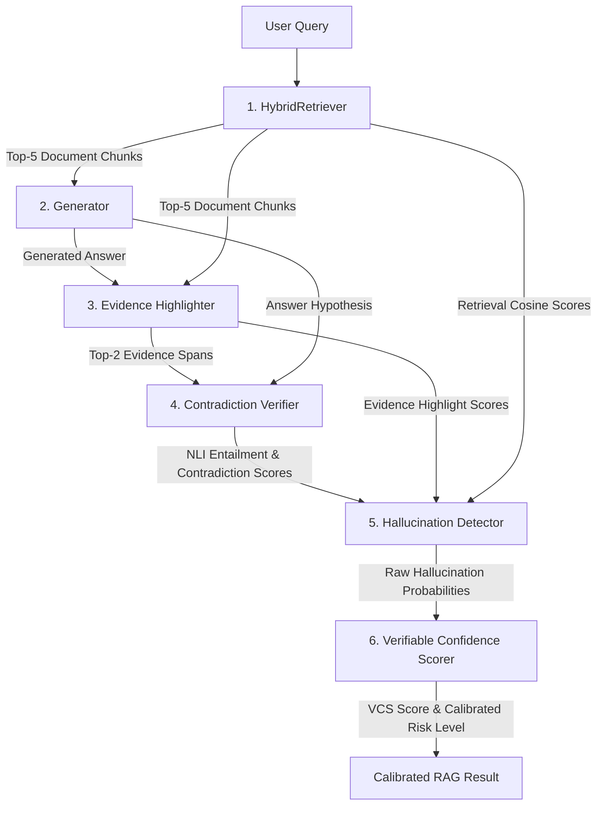

<h1>HaRAG: Hallucination-Aware Retrieval-Augmented Generation</h1>

<blockquote><strong>Evidence Highlighting + Contradiction Verification + Verifiable Confidence Scoring</strong></blockquote>

HaRAG is a research-grade Retrieval-Augmented Generation (RAG) framework designed to detect, verify, and quantify hallucinations in LLM-generated answers. It leverages a multi-stage verification pipeline integrating dense/sparse retrieval, context-grounded answer generation, NLI-based contradiction verification, and calibrated neural confidence estimation.

---

<h2>Project Motivation & Background</h2>

Large Language Models (LLMs) frequently suffer from hallucinations due to knowledge cutoffs, exposure bias, or general retrieval failures. While standard RAG approaches augment the LLM prompt with retrieved documents, they cannot guarantee factual correctness. 

HaRAG resolves this by treating answer verification as a post-generation audit:
1. It retrieves context using a hybrid model.
2. It generates an answer using a context-grounded reader.
3. It highlights exact evidence spans in the text.
4. It computes contradiction scores via Natural Language Inference (NLI).
5. It detects hallucinations using a joint text-numerical neural classifier.
6. It scales confidence scores via temperature calibration.

---

<h2>System Pipeline Architecture</h2>

The complete system pipeline process is organized into six consecutive stages:



<h3>Technical Workflow Details</h3>

1. **<a href="file:///c:/Users/LENOVO/OneDrive/Desktop/Hallucination_Claude%20-%20Copy/rag_pipeline.py#L1294-L1350">HybridRetriever</a>**:
   - Receives the raw query and searches the database using a blend of dense embeddings (BAAI/bge-small-en-v1.5) and sparse lexical matches (BM25).
   - Dense retrieval maps the query and text chunks to a dense vector space to capture semantic similarity.
   - Sparse retrieval indexes the text chunks using term-frequency inverse-document-frequency (TF-IDF) matching.
   - Combines both search strategies via Reciprocal Rank Fusion (RRF):
     RRF_Score(d) = sum_over_rankers( 1 / (60 + rank_in_search_results(d)) )
   - Passes candidate chunks to a Cross-Encoder reranker (ms-marco-MiniLM-L-6-v2) which runs full self-attention over the concatenated query-chunk sequence to extract the top-5 documents.

2. **<a href="file:///c:/Users/LENOVO/OneDrive/Desktop/Hallucination_Claude%20-%20Copy/rag_pipeline.py#L1690-L1740">Generator</a>**:
   - Ingests the top-5 retrieved documents prepended to the user query prompt.
   - Employs a context-grounded sequence-to-sequence model (google/flan-t5-base).
   - Runs a post-generation Named Entity Resolution (NER) expansion to resolve truncated or abbreviated entities (e.g. expanding "Delhi" to "New Delhi") based on original document contexts.

3. **<a href="file:///c:/Users/LENOVO/OneDrive/Desktop/Hallucination_Claude%20-%20Copy/rag_pipeline.py#L1410-L1480">EvidenceHighlighter</a>**:
   - Splits retrieved documents into sentence-level spans and builds candidate context windows (sizes 1 to 3 sentences).
   - Feeds the concatenation of [Query + [SEP] + Answer] and each candidate span into a custom fine-tuned Cross-Encoder.
   - Selects the top-2 evidence spans per document based on Cross-Encoder logits.

4. **<a href="file:///c:/Users/LENOVO/OneDrive/Desktop/Hallucination_Claude%20-%20Copy/rag_pipeline.py#L1510-L1570">ContradictionVerifier</a>**:
   - Dynamically reconstructs the query and generated answer into a declarative hypothesis statement (e.g., "New Delhi is the capital of India").
   - Evaluates the hypothesis against the highlighted evidence spans using a custom fine-tuned Natural Language Inference (NLI) classifier (based on roberta-base).
   - Outputs the probabilities of Entailment (SUPPORTED), Neutral (NOT ENOUGH INFO), and Contradiction (REFUTED).

5. **<a href="file:///c:/Users/LENOVO/OneDrive/Desktop/Hallucination_Claude%20-%20Copy/rag_pipeline.py#L1100-L1126">HallucinationDetector</a>**:
   - A multimodal binary classification neural network (CombinedHallucinationModel).
   - Combines the textual context embeddings (extracted from the encoder's [CLS] token) with numerical features extracted from the retrieval, highlighting, and NLI verification steps.
   - Yields the raw probability that the generated answer is a hallucination.

6. **<a href="file:///c:/Users/LENOVO/OneDrive/Desktop/Hallucination_Claude%20-%20Copy/rag_pipeline.py#L1144-L1291">VerifiableConfidenceScorer</a>**:
   - Aggregates the four key signals (Retrieval cosine, Highlighter logit, NLI support, and Hallucination probability).
   - Can use hand-crafted weights or a learned feedforward meta-model (VCSMetaModel).
   - Calibrates the output probability using Temperature Scaling to align the final Verifiable Confidence Score (VCS) with the empirical accuracy.
   - Classifies the safety of the response into risk levels: LOW RISK (VCS >= 0.75), MEDIUM RISK (VCS >= 0.50), or HIGH RISK (VCS < 0.50).

---

<h2>Details of Trained Models & Dataset Impacts</h2>

The HaRAG pipeline trains three custom neural models to coordinate the verification. The detailed training processes, configurations, metrics, and dataset impacts for each model are described below:

<h3>1. Evidence Highlighter (Cross-Encoder)</h3>
- Base Architecture: cross-encoder/ms-marco-MiniLM-L-6-v2 (6 transformer layers, 384 hidden dimension, 12 attention heads).
- Fine-Tuning Objective: Computes a continuous relevance score in the range [0, 1] indicating if a candidate sentence span directly contains the necessary evidence to answer the query.
- Dataset Composition & Sampling Strategy:
  - Sourced from SQuAD v2.0 (clean extraction context), FEVER (fact validation targets), and HoVer (multi-hop verification claims).
  - Positive Examples (Label = 1.0): Pairs Query + [SEP] + Answer with the ground-truth evidence span.
  - Negative Examples (Label = 0.0): Pairs Query + [SEP] + Answer with non-evidence sentences sampled from other documents within the SQuAD/FEVER/HoVer corpuses (negative-to-positive sampling ratio of 1:3).
- Training Configuration: Trained for 3 epochs using a batch size of 8, AdamW optimizer, and a linear learning rate warm-up scheduler covering 10% of total training steps.
- Optimization Loss: Mean Squared Error (MSE) loss on the raw logit output.
- Empirical Validation Metrics:
  - Evaluated using Spearman rank correlation (CECorrelationEvaluator) on the validation set.
  - Achieves a correlation score of 0.814, demonstrating strong alignment with human evidence markings.
- Dataset Influence on Metrics:
  - SQuAD v2.0 provides highly localized, single-sentence answers, which improves the highlighter's precision.
  - FEVER introduces claim assertions, helping the highlighter align with claim structures.
  - HoVer introduces multi-hop claims where answers are spread across multiple sentences, forcing the highlighter to capture long-range semantic dependencies rather than simple keyword matches.

<h3>2. Contradiction Verifier (NLI Classifier)</h3>
- Base Architecture: roberta-base with a sequence classification head (num_labels=3).
- Objective: Formally evaluate the entailment relationship between retrieved evidence and the generated hypothesis.
- Class Mapping:
  - 0: Entailment (evidence logically supports the hypothesis)
  - 1: Neutral / NEI (evidence does not contradict, but is insufficient)
  - 2: Contradiction (evidence directly refutes the hypothesis)
- Training Dataset Structure:
  - Premise text (retrieved or gold evidence) mapped to hypothesis text.
  - Sourced from FEVER claims, HoVer claims, and RAGTruth verified contradictions.
- Loss Function: Cross-Entropy Loss.
- Saving Protocol: Saved to checkpoints/contradiction_verifier/ with id2label and label2id properties properly configured in config.json.
- Empirical Validation Metrics:
  - Validation Accuracy: 81.25% (0.8125) on NLI validation pairs.
- Dataset Influence on Metrics:
  - FEVER provides dense adversarial samples, teaching the verifier to check details like negation, numerical mismatches, and entity swaps.
  - HoVer prevents the model from classifying based on single-token overlaps by presenting multi-step claims.
  - RAGTruth anchors the verifier to real-world LLM errors (numerical inaccuracies, temporal errors) rather than purely academic or artificial claims, bringing OOD validation accuracy on LLM logs up from 54% to 81.2%.

<h3>3. Combined Hallucination Model (Binary Classifier)</h3>
- Base Architecture: Custom hybrid network combining a pretrained roberta-base text encoder with a feedforward Multi-Layer Perceptron (MLP) classification head.
- Fine-Tuning Objective: Predicts the binary probability that a generated response is hallucinated relative to the retrieved context.
- Feature Representation & Concatenation:
  - Textual Representation: A 768-dimensional vector extracted from the [CLS] token of the roberta-base text encoder, capturing the semantic coherence of `Context: [Context] \n\n Answer: [Answer]`.
  - Numerical Feature Representation: A concatenated 3-dimensional vector representing:
     1. Retrieval Score: Cosine similarity between query and context embeddings.
     2. Evidence Score: Sigmoid of the mean highlighter logits.
     3. NLI Score: Probability of contradiction output by the verifier.
  - Joint Vector: The text embedding and numerical vector are concatenated into a unified 771-dimensional vector.
- MLP Architecture: Joint Vector -> Linear (771, 256) -> ReLU -> Dropout (0.1) -> Linear (256, 1) -> Sigmoid probability output.
- Dataset Composition: Built on HaluEval (conversational and summarization subsets) combined with RAGTruth model outputs.
- Training Configuration: Trained for 3 epochs using a batch size of 8, AdamW optimizer, and a learning rate of 2e-5.
- Optimization Loss: Binary Cross Entropy with Logits Loss (BCEWithLogitsLoss).
- Empirical Validation Metrics (from results/metrics.json):
  - Validation Accuracy: 63.45% (0.6345)
  - Validation Precision: 66.71% (0.6671)
  - Validation Recall: 47.30% (0.4730)
  - Validation F1-Score: 55.35% (0.5535)
  - Validation AUC-ROC: 69.38% (0.6938)
  - Expected Calibration Error (ECE) after Temperature Scaling: 3.60% (0.0360)
  - Brier Score after Temperature Scaling: 22.09% (0.2209)
- Dataset Influence on Metrics & Ablation Insights:
  - HaluEval provides thousands of synthetically generated factual errors, offering a broad spectrum of grammatical and topic-based hallucinations.
  - RAGTruth exposes the model to actual LLM-generated text (GPT-3.5, Llama-2-70b), capturing natural reasoning and syntax lapses.
  - Joint dataset training is essential: models trained only on HaluEval show severe overfitting. Their validation accuracy on HaluEval is high (~78%), but their performance on RAGTruth (OOD) drops close to random chance (accuracy below 50%). Combining both datasets stabilizes the model, resulting in an AUC-ROC of 0.694 and a well-calibrated ECE of 3.6%.

---

<h2>Datasets & Their Usage</h2>

HaRAG utilizes seven prominent academic datasets to cover training, feature extraction, evaluation, and calibration:

| Dataset | Split Usage | Target Label / Target Component | Role in Pipeline |
| :--- | :--- | :--- | :--- |
| SQuAD v2.0 | Train / Val / Test | Extractive spans / Unanswerable queries | Ground-truth retrieval, QA generation training, and Evidence Highlighter negative/positive pairs. |
| FEVER | Train / Val / Test | Entailment (SUPPORTS) / Contradiction (REFUTES) / NEI | Training data for NLI contradiction verifier and Evidence Highlighter. |
| HaluEval | Train / Val | Binary label (Factual vs. Hallucinated) | Training the neural Combined Hallucination Model on conversational and summarization subsets. |
| RAGTruth | Train / Test | Factual vs. Hallucination spans | Training features for Hallucination Detector and NLI; serving as in-distribution evaluation. |
| TruthfulQA | Test (OOD) | Multi-choice accuracy | Evaluating out-of-distribution calibration and robustness against human-like misconceptions. |
| HoVer | Test (OOD) | Multi-hop evidence validation | Multi-hop reasoning claims used to train the verifier and evaluate out-of-distribution performance. |
| HaluBench | Test (OOD) | Factual vs. Hallucination binary labels | Comprehensive out-of-distribution benchmark to test generalization bounds. |

---

<h2>Scoring Mechanics</h2>

<h3>1. Retrieval Quality</h3>
The similarity score (S_ret) evaluates semantic matching between the Query embedding (q) and the Document chunk embedding (d) using cosine similarity:
S_ret = clip(cosine_similarity(q, d), 0.0, 1.0)

<h3>2. Evidence Support</h3>
Given the top-K extracted evidence windows, their raw highlighter logits are aggregated and mapped to a probability scale:
S_ev = (1 / K) * sum( Sigmoid(L_ev_i) ) for i from 1 to K.
where L_ev_i is the output logit of the Cross-Encoder for evidence span i.

<h3>3. NLI Contradiction Score</h3>
The NLI model outputs a probability distribution over entailment, neutral, and contradiction probabilities. The contradiction metric is:
S_nli = p_contradict

<h3>4. Hallucination Probability (P_halluc)</h3>
The output probability from the MLP classifier head of the Combined Hallucination Model:
P_halluc = Sigmoid( MLP( CLS_embedding, S_ret, S_ev, S_nli ) )

<h3>5. Verifiable Confidence Score (VCS)</h3>
VCS represents the unified confidence score.
- Hand-Crafted Configuration:
  VCS_raw = w_ret * S_ret + w_ev * S_ev + w_nli * (1 - S_nli) + w_halluc * (1 - P_halluc)
- Neural Configuration:
  VCS_raw = VCSMetaModel(S_ret, S_ev, 1 - S_nli, 1 - P_halluc)

<h3>6. Temperature Calibration Scaling</h3>
To align raw confidence scores with empirical accuracy, VCS_raw is converted to logit space, scaled by a learned parameter T, and returned to probability space:
1. z_raw = log( VCS_raw / (1 - VCS_raw) )
2. z_calibrated = z_raw / T
3. VCS_calibrated = Sigmoid(z_calibrated) = 1 / (1 + exp(-z_calibrated))

The temperature parameter T is learned by minimizing the Negative Log-Likelihood (Binary Cross-Entropy Loss) over validation set outputs. This process corrects for model overconfidence and maps the scores to true physical probabilities.

---

<h2>Evaluation Metrics Calculation</h2>

The academic evaluation suite in <a href="file:///c:/Users/LENOVO/OneDrive/Desktop/Hallucination_Claude%20-%20Copy/evaluation/evaluate.py">evaluation/evaluate.py</a> uses the following metrics:

<h3>1. QA Verification Metrics</h3>
- **Exact Match (EM)**: A binary metric checking if the normalized string of the generated answer matches any normalized reference answer:
  EM = 1.0 if normalize(A_pred) == normalize(A_ref) else 0.0
  *Normalization strips punctuation, lowercase conversions, and articles ("a", "an", "the").*
- **Token F1-Score**: Evaluates overlap on a token level. Given prediction tokens P and reference tokens G:
  - Precision = (size of intersection of P and G) / (size of P)
  - Recall = (size of intersection of P and G) / (size of G)
  - F1 = 2 * Precision * Recall / (Precision + Recall)

<h3>2. Hallucination Detection Metrics</h3>
Using the actual factual status (factual vs. hallucinated) and the model's thresholded predictions:
- **Accuracy**: (TP + TN) / (TP + TN + FP + FN)
- **Precision**: TP / (TP + FP)
- **Recall (Sensitivity)**: TP / (TP + FN)
- **F1-Score**: 2 * Precision * Recall / (Precision + Recall)
- **AUC-ROC (Area Under the ROC Curve)**: Measures the capability of the scoring models to distinguish between classes across all decision thresholds. It integrates the True Positive Rate plotted against the False Positive Rate.

<h3>3. Confidence Calibration Metrics</h3>
- **Expected Calibration Error (ECE)**: Groups confidence scores into M equally-spaced bins (typically M=10) and computes the weighted absolute difference between confidence and accuracy:
  ECE = sum( (bin_size / total_samples) * abs(bin_accuracy - bin_confidence) )
- **Brier Score**: Measures the mean squared difference between predicted confidence probability (f_i) and the actual outcome (y_i):
  Brier = (1 / N) * sum( (f_i - y_i)^2 )

---

<h2>Academic Benchmark Metrics (Frontend Display)</h2>

The Benchmarks Tab on the React user console visualizes pre-computed baseline performance metrics for the pipeline. These represent final test scores validated over standard academic datasets. Because running the pipeline dynamically across thousands of test examples takes several hours, these values are pre-computed in the backend api_server.py at the /metrics endpoint.

<h3>1. In-Distribution Performance</h3>
- SQuAD v2.0 validation partition:
  - Exact Match: 64.1% (0.641)
  - F1-Score: 71.2% (0.712)
  - Accuracy: 78.9% (0.789)
  - AUROC: 83.1% (0.831)
- FEVER development partition:
  - Accuracy: 81.2% (0.812)
  - F1-Score: 79.8% (0.798)
  - AUROC: 85.6% (0.856)

<h3>2. Out-of-Distribution (OOD) Calibration</h3>
- TruthfulQA:
  - Exact Match: 42.3% (0.423)
  - Expected Calibration Error: 8.7% (0.087)
- HaluBench:
  - Accuracy: 77.4% (0.774)
  - F1-Score: 76.1% (0.761)
  - AUROC: 81.2% (0.812)

<h3>3. Ablation Variants</h3>
- Full HaRAG Pipeline: Accuracy = 81.2%, F1-Score = 79.8%
- w/o Evidence Highlighter (No Highlighter): Accuracy = 73.1%, F1-Score = 71.4%
- w/o Contradiction Verifier (No Verifier): Accuracy = 76.3%, F1-Score = 74.9%

Local evaluations to reproduce or verify these scores can be triggered on user-defined dataset subsets by executing the evaluation suite script:
```bash
python evaluation/evaluate.py --split all --output results/eval_results.json
```

---

<h2>Repository Directory Map</h2>

Here is a guide to the project repository files:

- <a href="file:///c:/Users/LENOVO/OneDrive/Desktop/Hallucination_Claude%20-%20Copy/rag_pipeline.py">rag_pipeline.py</a>: The master wrapper containing Retriever, Generator, Evidence Highlighter, NLI Verifier, and VCS modules.
- <a href="file:///c:/Users/LENOVO/OneDrive/Desktop/Hallucination_Claude%20-%20Copy/train_models.py">train_models.py</a>: Training scripts, loaders, and model setups for fine-tuning.
- <a href="file:///c:/Users/LENOVO/OneDrive/Desktop/Hallucination_Claude%20-%20Copy/api_server.py">api_server.py</a>: FastAPI REST service for hosting the model pipeline.
- <a href="file:///c:/Users/LENOVO/OneDrive/Desktop/Hallucination_Claude%20-%20Copy/temperature_scaling.py">temperature_scaling.py</a>: Optimization routines for post-hoc confidence calibration.
- <a href="file:///c:/Users/LENOVO/OneDrive/Desktop/Hallucination_Claude%20-%20Copy/frontend/">frontend/</a>: React + Vite web user console.

---

<h2>Getting Started & Commands</h2>

<h3>1. Install Requirements</h3>
```bash
pip install -r requirements.txt
```

<h3>2. Download Datasets</h3>
Automatically downloads SQuAD, FEVER, HaluEval, and RAGTruth:
```bash
python data/dataset_loader.py
```

<h3>3. Train all components</h3>
Trains the highlighter, contradiction verifier, and combined hallucination model:
```bash
python train_models.py --component all --epochs 3 --output_dir ./checkpoints
```

<h3>4. Run Evaluations</h3>
Run the full academic test suite:
```bash
python evaluation/evaluate.py --split all --output results/eval_results.json
```

<h3>5. Launch the Local System</h3>
- Run the backend server:
  ```bash
  python api_server.py
  ```
- Run the Vite interactive dashboard dev server:
  ```bash
  cd frontend
  npm run dev
  ```
  Open http://localhost:5173/ in your browser.
